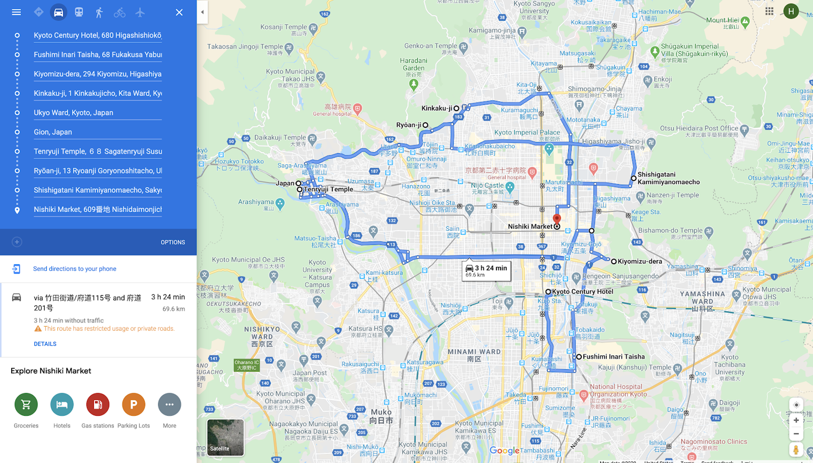
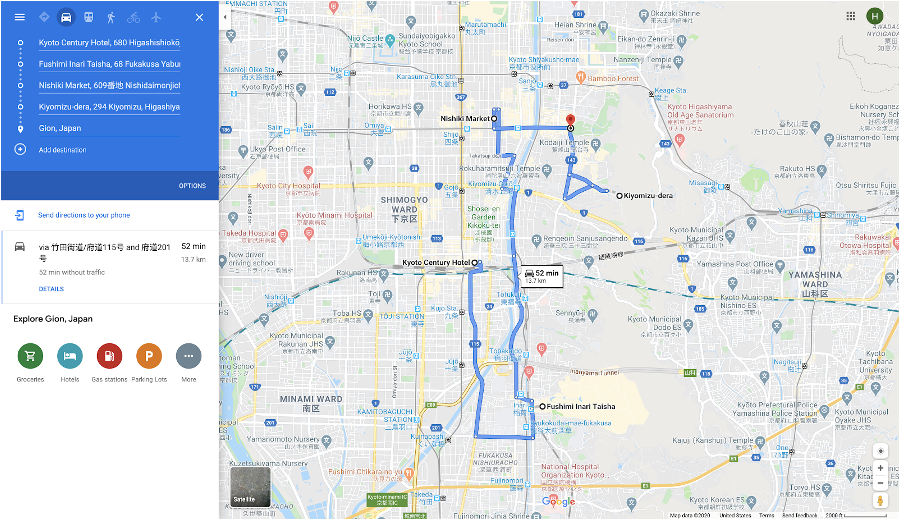
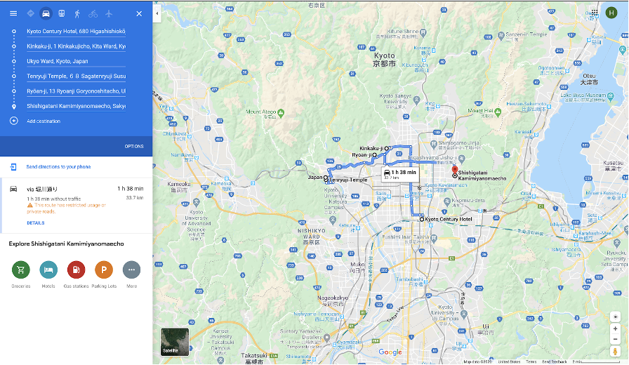

# OptTripItin
Ever find planning your trip in google maps tedious? Optimize your trip itinerary based on the number of days you're staying and optimize the order in which you visit them. I was inspired to create this tool when I was planning a 2 day trip in Kyoto. Web App Release coming soon.

## My Messy Kyoto Itinerary- All destinations plotted on Google Maps

## Optimized Day 1 Itinerary

## Optimized Day 2 Itinerary

## Disclaimers
Modified a BALANCED K-MEANS algorithm with a bipartite graph by MIKKO MALINEN of University of Eastern Finland's Faculty of Science and Forestry.
http://cs.uef.fi/sipu/pub/PhD_Thesis_Mikko_Malinen.pdf
